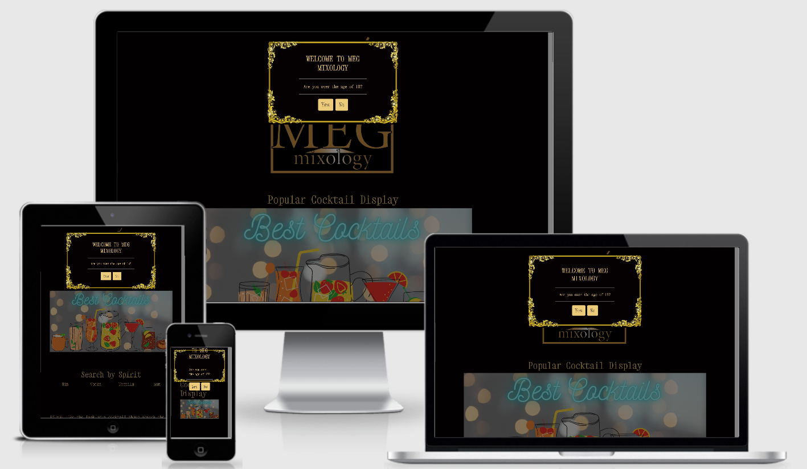

# MileStone Project Two- Meg Mixology

An interactive fun front end website. I am designing a website that brings a little bit of my normal everyday
life into teaching other a few recipes and tricks. I am an assistant manager of a pub and it is my life so it's
time to share a bit of this in a fun way with the rest of the world. A website that will be kept up to date via 
the Cocktail DB API and bring a little lockdown joy to others.
 
# Table of Contents

**[UX](#UX)** 
**[Features](#Features)** 
**[Technologies Used](#Technologies-used)** 
**[Testing](#Testing)** 
**[Deployment](#Deployment)** 
**[Credits](#Credits)** 
**[Acknowledgement](#Acknowledgement)** 

## UX
 

### User Stories
--
1. As someone who is stuck in lockdown, I want to explore different cocktails and find the one for me.
2. As someone who has alwyas loved cocktails, I want to explore what different spirits go with what ingredients.
3. As a cocktail lover myself, I love exploring new ideas and adding my own twist.
4. As a newcomer to the hospitliaty industry I want to broaden my horizons and learn new things.
5. As someone who is trying top develop my busines it is always good to see what cocktails are the most popular 
and learn a few more tricks in the meantime.
6. As a business owner I love looking outside the box and expanding my business ventures with what the world has to offer.

### Wireframes
Below I have 2 different Wireframes in order to ensure the design of my project works responsively. These were ofcourse 
the initial design and a few parts have changed due to practicality and more realistic when visualy looking at the end product.
The medium and desktop are the same as it was only smaller devices where it had to be changed. Both are in the same folder. 

#### DESKTOP
[Desktop WireFrames](https://github.com/megmog88/Meg-Mixology-MS2/blob/master/MS2%20Wireframes%20For%20Desktop%2CTablet%20and%20Mobile.bmpr)

#### MOBILE 
[Mobile WireFrames](https://github.com/megmog88/Meg-Mixology-MS2/blob/master/MS2%20Wireframes%20For%20Desktop%2CTablet%20and%20Mobile.bmpr)

### Color scheme
I chose a bold and cool color scheme which is reflected all through my project as cocktail bartenders are bold and cool, below is 
an image of colors used. Codes are ##050001, #eccb7a,

### Typogrophy
Using google fonts i decided to use the following font "'Xanh Mono', monospace;" as I believe this had a good feel for 
my project and fits in well with the message trying to be portrayed. 

## Features

### Carousel
I have implented a carousel with the 20 most popular cocktails for website guests to look over.
It shows the most current cocktails from the Cocktail DB API which is regularyly uodated to keep 
everyone well informed and up to date on the current most popular cocktails. A brilliant way to 
get ideas if opening a business or trying to get yours up to date, as well as a new comer to our 
industry to learn the current tricks of the trade.

### Search by main spirit
We all know what alcohol we like and sometimes need inspiritation so the best way to do this is by searching
your spirit of choice and getting a few ideas of what can come next. Also a brilliant tool for variation if 
designing a new menu or broadenning your own horizons.

### Search cocktail recipe by recipe name
Allow the user once seen different cocktail to retrieve the recipe from the cocktail API. Even look up ones that may
not feature in my project but are in the API. A great little tool if some forgets what liqor goes in an old fashioned
for instance. A great little tool for the user to gain knowledge as well.

### Chose your Destiny
Just adding a bit of fun to my website to make the cards chose your cocktail by attaching a "random cockatil" link 
to each card. So yes if you try again you may get a different cocktail, however destiny is always correct and the first
coktail is your destiny. Just a bit of fun to keep everyone entertained. What was your destiny?

## Features Left to Implement
I have a few features left to implement and these are as follows.
### Equipment
I would like to add a feature showing the different equipment need to incorporate with different levels of experience for
different users. Looking at the best place to buy, best quality, best value for money etc.
### A sweet or sour section
Going forward sweet and sour is a strong impact on whether we enjoy a cocktail or not, so I would like to incorporate this 
as a section to which my users can chose between a sweet or sour cocktail.

## Technologies Used
Below is a list of all technologies used in order to achieve the end goal.

#### Languages
* HTML -A standard markup language used for the content of my webpage
* CSS - A style sheet language used for the design of the web page
* JavaScript - A text based programming language used to make a web page
interactive, in conjunction with HTML and CSS as a base for formatting.

#### Frameworks
* Bootstrap [https://v4-alpha.getbootstrap.com/]- Used for layout of my web page and for styling as well.
* JQuery [https://code.jquery.com/jquery-3.5.1.js]
#### Libraries
* Google Fonts [https://fonts.google.com/]
* Font Awesome(Bootstrap Library) [https://www.bootstrapcdn.com/fontawesome/]
* Bootstrap Jquery and Popover for my form on register.html [https://getbootstrap.com/docs/3.3/javascript/]
* W3 Schools [https://www.w3schools.com/] a great base to get refresher materialswhen help was needed.
* Youtube [https://www.youtube.com/] for some tutorials when things where tough

##### GitPod/GitHub
* GitPod was the IDE I used for my project
* GitHub was used to host my website and the repositary

## Testing 

* W3C HTML Validator[https://validator.w3.org/]
* W3C CSS Validator[https://jigsaw.w3.org/css-validator/]
* Autoprefixer CSS[https://autoprefixer.github.io/]
* JavaScript Validator[https://extendsclass.com/javascript-fiddle.html]
* Am I responsive [http://ami.responsivedesign.is/] used to check compatibility with a numerous amount of devices,
see picture below.

* I consistantly was using chrome web developer tools, however when push to my mobile found these to not be the most
accurate. The design was though out to ensure smaller screens were not squished and legible throughout. The layout 
of the other pages are slightly different throughout each breakpoint.

* Tested each page manually to ensure effects worked throughout and responded accordingly.
* Tested manually on teh following devices
    - Iphone 7
    - Ipad 
    - Ipad Pro
    - HP Windows Laptop
    - Mac Book Pro
* Browser Capability- I have tested on the following browsers.
    - Mozilla
    - Microsoft Edge
    - Safari
    - Google Chrome
    - Internet Explorer
    The only one that my site does not work on is Internet Explorer but this is a known issue as I used fetch API
    which is not supported by this browser so a known bug. Internet Explorer is however outdated.

## Testing User Stories
1. As a user in lockdown I can easily be inspired by the many different cocktails displayed on the pageand even 
take a look by my flavour interests.
2. As someone excited to learn new twists I can now do this with a bit of help and guidance
3. As a cocktail lover I can explore other options out there and broaden my horizons
4. As a newbie in hospitality I can now easily acces a lot of information and look good infront of my boss.
5. As a business developer the websoite shows me up to date cocktails and shows me trends in the cocktails. Also
allows me to strengthen my knowledge.
6. The world clearly has a lot more for me to offer and a business owner and making cocktails is definately one of them.
 
## Issues while Testing
* I had a few issues with HTML validator, I corrected some which had bad/unused id's in them, however there are 
two errors in which I have left as it works. The role of button shouldn't have an a link. 
* My CSS came back with 3 errors, however 2 were linked through to bootstrap with unknown attributes. I had one unknown
media query come back. Fixed and sorted. 
* JavaScript- I was just missing a few semi colons that are now in place. 

## Deployment
My project was started on GitHub[github.com] by making a repositary and then using them with the GitPod IDE. I did the 
following steps in order to deploy my project.

1. From GitPod after the latest commit then we use GitPush to get the code in GitHub repositary.
2. Go to the required GitHub repositary and go to settings.
3. Scroll down to GitHub Pages section in settings
4. Where it says source choose master branch.
5. Then your site is published
6. The link is [https://megmog88.github.io/Meg-Mixology-MS2/] to the live website.

## Clone or Download
1. When in the git hub repositary click on the green button "Clone or Download"
2. Copy the URL that is produced
3. Open your chosen IDE
4. Type in the workspace "git clone"
5. The paste the copied URL
6. Press enter
7. And you are complete :)

## Credits

### Content
* The SearchRecipe part of my code was inspired and mostly taken from the followoing link(author: Terry Lenox) as it helped me to understand and
added value to my project.
[click here to view](https://stackoverflow.com/questions/49580528/how-to-filter-through-json-return-from-api-with-similar-prop)
* All written by myself(Meghan Jane Spence)
* Used  cocktail DB API[https://www.thecocktaildb.com/api.php] to get cocktail information running through my website
### Media
* Golden Border Cliparts #2506192 (License: Personal Use)
* Card Images I got from my sister as she had them available and made the background transparent for me.
* Cocktail images come from the coktail API

## Acknowledgements
* First and foremost my little sister(best friend) for helping with the logo and encouragement throughout,
all be lockdowned seperately this time around.
* The guys who have been working on site with me and having to hear me constantly until it works then have 
to endure me dancing.
* My mentor(well in this case 2 mentors), Maranatha and Gerard. I had some last minute fighting to play catch up with ,
and they stepped in last minute to show me some valuable guidance.

